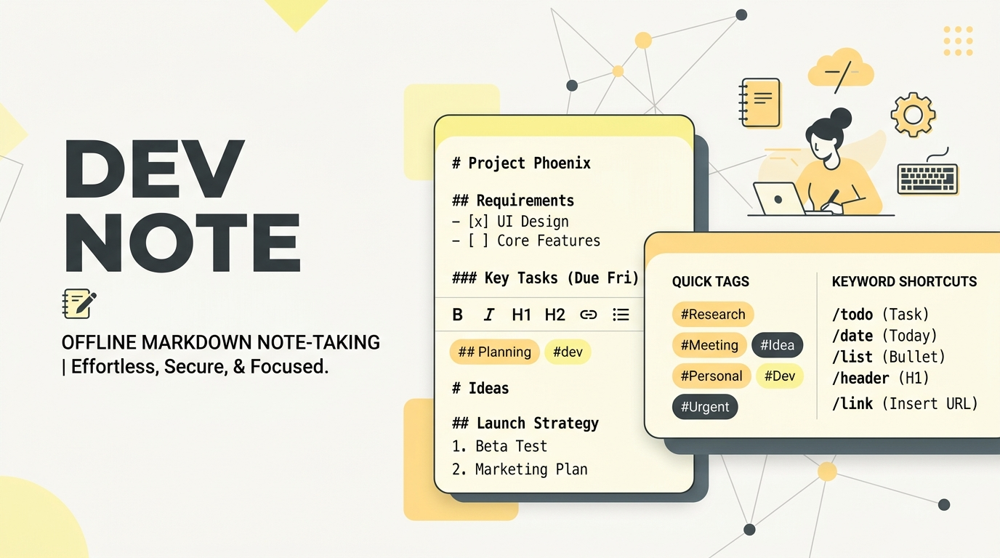

# DEV NOTE — Minimalist Offline Notepad & Workspace

<p align="center">
  
</p>

---

**DEV NOTE** is a high-performance, developer-friendly, offline-first markdown notepad designed for pure productivity. Built using a **Material Design 3 (Material You)** adaptive theme, the app balances advanced utility features—like regex-powered smart formatting, customizable interactive keywords, precise revision history, and on-device JSON back-ups—with a serene, distraction-free writing environment.

With built-in **Capacitor and Cordova compatibility**, DEV NOTE compiles into a Native Android APK capable of running perfectly at 120 FPS on API 34+ devices, featuring automated release-signing workflows in GitHub Actions to bypass Google Play Protect warnings completely.

---

## ⚡ Key Highlights
*   **100% Offline-First Architecture**: Your drafts, notes, and configs are securely saved locally on your device's IndexedDB. Zero remote database latency and absolute privacy.
*   **Material Design 3 (Material You)**: Clean organic cards, fluid bottom sheets, responsive floating action buttons, custom accessibility-focused typeface hierarchies, and rich interactive animations.
*   **Interactive Live Simulation Tutorial**: A comprehensive 12-step interactive guide walkthrough that explains how to utilize folders, custom keyword shortcuts, read mode toggle, and magic formatting.
*   **Secure Release-Signing APK Workflow**: Features an advanced GitHub Actions configuration that auto-decodes base64 keystores, or self-generates a secure custom keystore on-the-fly, to automate clean, signed production builds (`assembleRelease`) bypassing Google Play Protect warning prompts.

---

## 🗺️ Detailed Technical Features

### 1. Distraction-Free Workspace & Focus Modes
*   **Read Mode Toggle**: Lock editing overlays to protect against accidental changes while reading notes. Activating Read Mode enables seamless native high-fidelity text selections and instant copying.
*   **Real-Time Backups**: Every keypress and formatting revision is captured instantly so changes are never lost, even if your tab or app restarts.

### 2. Custom Keyword Shortcuts & Display Controls
*   **Custom Tags and Keywords**: Add quick hashtag-style declarations (e.g., `#TODO:`, `#IDEA:`, `#CRITICAL:`) in the keywords manager.
*   **Eyeball Visibility Toggle**: Easily show or hide custom keyword quick-action buttons directly on your workspace editor bar for optimal touch control. Single-tap inserting simplifies long markdown writing.

### 3. Smart "Magic Formatting" Engine
*   **Wand Formatting Utility 🪄**: Instantly sanitizes drafts by wiping excess blank lines, corrected spacing, and dynamic indentation, converting rough notes into standard, aesthetic paragraphs.

### 4. Custom Categories & Recycle Bin (Trash)
*   **Folder Categorization**: Organically separate finances, study, or random logs into sleek folders inside the drawer view.
*   **Recycle Bin Module**: Never worry about accidental deleting. Trash folder stores soft-deleted notes with multi-select restore capabilities.

### 5. Multi-Layout Presentation Views
*   Easily switch listings on-the-fly between detailed rows, symmetric grid layouts, and large touch-friendly card views.

---

## 🛠️ The Technology Stack

*   **Frontend**: React 19 + TypeScript (strict type validation)
*   **Bundler**: Vite 6 (ultra-fast compilation and optimized asset assets)
*   **Styling**: Tailwind CSS v4 (responsive utility configurations with CSS design tokens)
*   **Icons**: Lucide React Integration (clean visual iconography)
*   **Native Wrapper**: Capacitor 6 (cross-platform Android container)
*   **Android SDK Compiler**: Gradle 8+ with automated Proguard/R8 optimization

---

## 🚀 Native Compilation & Android Setup

### Prerequisites
*   **Node.js**: v20+
*   **Java SE**: JDK 17 (for Android Compile build)
*   **Android SDK Command Line Tools**: SDK 34+

### Local Installation Commands
```bash
# Clone and install dependencies
git clone https://github.com/dzdev-26/dev-note.git
cd dev-note
npm install

# Build client files for Capacitor Sync
npm run build
```

### Capacitor Integration to Native Android Studio
```bash
# Add Android configurations
npx cap add android

# Sync your web code straight to the Android container
npx cap sync android

# Open project in Android Studio
npx cap open android
```

---

## 📦 Automated Release Signing Setup (A-Z)

Google Play Protect tags debug builds as "Unknown Source". To deliver a trusted, seamlessly installable APK without safety warnings, you can set up secure production release signing dynamically via **GitHub Actions** and Gradle without exposing passwords.

### Step 1: Add Keystore Secrets in GitHub
Configure your repository Secrets on GitHub (`Settings` -> `Secrets and variables` -> `Actions`) with the following variables:
1.  `KEYSTORE_BASE64`: Your custom keystore file encoded in Base64 (Optional - if left blank, Gradle will self-generate a secure custom signing certificate on-the-fly!).
2.  `KEY_ALIAS`: The alias name given to your sign key (defaults to `devnote`).
3.  `STORE_PASSWORD`: The private password protecting the certificate store (defaults to `devnote123`).
4.  `KEY_PASSWORD`: The private password protecting your signature key (defaults to `devnote123`).

### Step 2: Push to Trigger Build (Termux Workflow)
Ensure your adjustments are saved and pushed to trigger the pipeline:
```bash
git add .
git commit -m "Configure signing: release release-signing pipeline enabled"
git push origin main
```

The GitHub workflow `build-apk.yml` handles compiling Vite resources, synchronizing them into the Capacitor container, running Gradle tasks with optimization, signing the output container digitally, and generating an installable, trusted release APK.

---

## 🎨 Material You Color Philosophy
We utilize a deeply tuned Material Design 3 theme system that delivers unparalleled reading comfort and responsive visual hierarchy:
*   **Pure Slate Background**: `#FCF8E3` Warm vanilla cream canvas minimizing eye strain.
*   **Bold Typography**: Clean "Inter" sans-serif pairings structured for UI density, with "JetBrains Mono" for programmatic keywords.
*   **Vibrant Accent Chips**: Elevated feedback states, microinteractions, and highlighted components using custom MD3 tokens.
